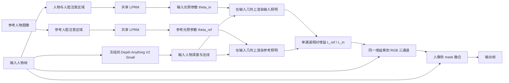

# RRNet-Based Reference Lighting Transfer for Video Conferencing

基于 RRNet 思路实现的轻量级人物视频重光照系统：从指定参考人物中估计目标光照，并将其迁移到其他参会者的人像区域，同时尽量保持身份、肤色和背景不变。

> [!IMPORTANT]
> 本仓库是依据论文公开公式和文字描述完成的独立研究复现与扩展，不是 RRNet 作者的官方实现。原论文代码、FFHQL 数据集、训练权重和完整超参数尚未公开，因此本项目不能被视为逐行复现，也不宣称复现了论文中的全部指标。

## 项目目标

本项目面向多人视频会议中的光照统一问题：选定一名参会者作为参考，其他人物的光照向参考人物靠拢。

设计约束：

- 保持输入人物的身份、五官、纹理和人种肤色；
- 不采用生成式人脸重建；
- 只修改人像区域，背景使用原始输入；
- 使用共享 RGB 增益，减少红蓝色块和肤色漂移；
- 对视频光照参数和人像 mask 做时序处理；
- 支持 FP16、光照/深度/分割的间隔更新，以适配 1080P 推理。

## 方法概览



核心实现位于 [`rrnet/reference_relative_model.py`](rrnet/reference_relative_model.py)：

1. 输入图和参考图共享同一个 LPRM，分别预测 `theta_in` 与 `theta_ref`；
2. 将两组光照参数都渲染在输入人物自己的深度和法线上；
3. 计算有界相对增益 `gain = L_ref / L_in`；
4. 将同一个单通道增益应用到 RGB 三通道，保护输入人物色度；
5. 使用人像软 mask 与原始帧融合，保持背景不变；
6. 参考图只编码一次，输入光照参数在视频中进行 EMA 平滑。

当前主线不使用密集 RGB 残差头，也默认关闭 AGM。此前实验表明，密集残差在真实夜间视频中容易引入模糊、发际线彩边和颜色游走。

## 与 RRNet 论文的关系

仓库实现了论文公开描述的主要组件：

- RepViT 编码器与粗/细双分支 LPRM；
- 9 个可配置虚拟光源参数；
- 论文公式 (2) 的参数统计校准；
- Depth Anything V2 Small 深度估计；
- 基于深度和法线的简化 Blinn-Phong 渲染；
- 可选 AGM；
- 视频光照参数 EMA；
- 每 1、3 或 10 帧更新光照参数的调度方式。

“指定参考参会者光照”不是 RRNet 原论文功能。本仓库在 RRNet 主干之上增加了双图光照估计、跨人物参考三元组和相对照明迁移。

## 仓库结构

```text
.
├── configs/                         # 训练与推理配置
├── rrnet/
│   ├── lprm.py                      # 光照参数回归模块
│   ├── renderer.py                  # 深度感知光照渲染
│   ├── reference_relative_model.py  # 参考相对光照迁移模型
│   ├── reference_data.py            # 跨人物参考三元组数据集
│   ├── reference_relative_loss.py   # 参考迁移损失
│   ├── person_mask.py               # 人像 mask 与 GPU 后处理
│   └── ...
├── tools/
│   ├── build_mead_rrnet_dataset_v2.py
│   ├── evaluate_reference_transfer_grid.py
│   └── ...
├── tests/                           # 单元测试
├── train.py                         # 统一训练入口
├── infer_video.py                   # RRNet 基线视频推理
├── infer_reference_relative_video.py# 参考光照视频推理
├── calibrate_lighting_stats.py
├── calibrate_relative_lighting_stats.py
└── requirements.txt
```

## 环境要求

建议环境：

- Python 3.10；
- PyTorch 2.5 或更高版本；
- CUDA GPU；
- Windows 或 Linux。

安装项目依赖：

```bash
python -m pip install -r requirements.txt
```

### Depth Anything V2

本项目依赖官方 [Depth Anything V2](https://github.com/DepthAnything/Depth-Anything-V2)。请将官方仓库和 Small 权重放置为：

```text
third_party/Depth-Anything-V2/
checkpoints/depth_anything_v2_vits.pth
```

训练时深度网络永久冻结。`allow_depth_proxy: true` 只用于无权重的单元测试，不应用于正式训练或推理。

### MediaPipe 人像分割

默认模型路径：

```text
third_party/mediapipe/models/selfie_segmenter.tflite
```

第三方仓库、模型权重、数据集和训练检查点均不包含在本仓库中，请遵守各自的许可证与使用条款。

## 数据集

当前实验使用经过处理的 [MEAD](https://wywu.github.io/projects/MEAD/MEAD.html) 正面人物帧作为 clean frame，并生成以下 7 类训练输入：

| 类别 | 含义 |
|---|---|
| `identity` | 不退化的正常输入 |
| `underexposed_cool` | 冷色欠曝 |
| `window_backlight` | 窗口背光 |
| `warm_side_light` | 暖色侧光 |
| `top_light_shadow` | 顶光与面部阴影 |
| `warm_overexposure` | 暖色过曝 |
| `mixed_office` | 混合办公光照 |

每条记录包含：

```text
clean_frame
bad_light_frame
skin_mask
relight_mask
person_id
split
degradation_id
```

数据集根目录需要包含：

```text
dataset/
├── metadata.csv
├── generation_manifest.json
├── train/
├── val/
└── test/
```

数据集不会随仓库发布。使用前请在配置文件中修改：

```yaml
data:
  root: "/path/to/your/dataset"
```

### 参考三元组

训练样本由 [`rrnet/reference_data.py`](rrnet/reference_data.py) 动态构造：

```text
输入 A：人物 A 的某种输入光照
参考 B：不同人物 B 的目标光照
目标 T：人物 A 在参考 B 的具体合成光照参数下的图像
```

目标图始终保留人物 A 的身份和色度。代码从 `generation_manifest.json` 读取参考样本的具体光照配置与时间相位，将其应用到人物 A 的 clean frame，而不是直接将人物 B 的图像作为真值。

## 配置

公开示例训练配置（数据路径需要按本机情况修改）：

```text
configs/example_reference_relative.yaml
```

进行 1080P 速度测试时，可复制该配置并将 `model.depth_input_size` 从 `518` 改为 `448`。这不会改变 Depth Anything 权重，但需要重新评估精度与延迟。

关键参数：

```yaml
model:
  use_agm: false
  depth_input_size: 518       # 速度版本使用 448
  min_transfer_gain: 0.40
  max_transfer_gain: 5.00
  achromatic_illumination: true
  preserve_chromaticity: true

video:
  theta_beta: 0.95
```

## 训练

### 校准相对光照统计量

正式训练前先拟合公式 (2) 使用的均值和标准差：

```bash
python calibrate_relative_lighting_stats.py \
  --config configs/example_reference_relative.yaml
```

生成的统计文件默认由配置中的 `statistics_path` 指定。

### 从头训练

```bash
python train.py \
  --config configs/example_reference_relative.yaml
```

每次训练会在 `output_dir/run_YYYYMMDD_HHMMSS/` 下保存：

```text
train.log
train_metrics.jsonl
val_metrics.jsonl
run_config.json
rrnet_step_XXXXXXX.pt
```

### 恢复训练

恢复模型、优化器、学习率调度器和训练步数：

```bash
python train.py \
  --config configs/example_reference_relative.yaml \
  --resume outputs/<run>/rrnet_step_XXXXXXX.pt
```

只加载模型参数并创建一个新的微调实验：

```bash
python train.py \
  --config configs/<new_experiment>.yaml \
  --init-from checkpoints/rrnet_reference_relative.pt
```

## 视频推理

```bash
python infer_reference_relative_video.py \
  --config configs/example_reference_relative.yaml \
  --checkpoint checkpoints/rrnet_reference_relative.pt \
  --input examples/input.mp4 \
  --reference examples/reference.png \
  --output outputs/result.mp4 \
  --precision fp16 \
  --light-every 10 \
  --depth-every 3 \
  --mask-backend gpu \
  --mask-every 3 \
  --mask-work-width 512
```

参数说明：

- `--light-every 10`：每 10 帧重估一次输入光照参数；
- `--depth-every 3`：每 3 帧更新一次深度；
- `--mask-every 3`：每 3 帧运行一次人像分割，中间帧复用 GPU mask；
- `--theta-beta 0.95`：覆盖配置中的光照参数 EMA 系数；
- `--max-transfer-gain`：仅在推理时覆盖最大相对增益；
- `--mask-mode none`：关闭人像融合，用于整帧 RRNet 消融。

参考图只在视频开始时编码一次。输出 MP4 当前不会复制原视频音轨。

## 评测

运行“输入类别 × 参考类别”的严格合成配对评测：

```bash
python tools/evaluate_reference_transfer_grid.py \
  --config configs/example_reference_relative.yaml \
  --checkpoint checkpoints/rrnet_reference_relative.pt \
  --dataset-root /path/to/dataset \
  --output-dir outputs/reference_transfer_grid \
  --splits val \
  --precision fp16
```

评测输出包括：

- 逐样本 CSV；
- 输入类别 × 参考类别指标矩阵；
- PSNR、SSIM、LPIPS；
- 人物区域指标；
- 皮肤区域 Lab / ΔE76；
- 相对增益误差；
- 各输入类别的对比图和热力图。

## 初步结果

以下为当前研究过程中的内部基线结果，不应视为最终论文 test 结果。历史实验曾使用 `val + test` 辅助模型选择，因此现有 test 已间接参与调参，正式实验必须重新保留从未查看的人物测试集。

### 合成配对评测

当前 14k 基线在 245 个跨人物、跨光照组合上的结果：

| 指标 | 数值 |
|---|---:|
| Full PSNR | 23.7159 dB |
| Full SSIM | 0.8911 |
| Person PSNR | 22.9267 dB |
| Person SSIM | 0.8950 |
| LPIPS | 0.0816 |
| Skin ΔE76 | 8.6085 |
| Gain log MAE | 0.2924 |

与未经处理的输入相比，人物区域平均指标变化为：

| 指标 | 输入 | 模型输出 |
|---|---:|---:|
| Person PSNR | 22.7905 | 22.9267 |
| Person SSIM | 0.8378 | 0.8950 |
| LPIPS | 0.0853 | 0.0816 |
| Skin ΔE76 | 13.7666 | 8.6085 |

### 1080P 延迟

测试环境：RTX 4060 Laptop GPU、PyTorch 2.5.1 + CUDA 12.1、FP16、1920×1080、`L10/D3/M3`、Depth 输入 448。

不包含视频编解码、磁盘 I/O、指标计算、模型初始化和一次性参考编码：

| 帧类型 | 平均延迟 | 等效 FPS |
|---|---:|---:|
| 总体平均 | 55.45 ms | 18.03 |
| 普通缓存帧 | 21.67 ms | 46.14 |
| 仅深度更新帧 | 108.01 ms | 9.26 |
| 仅光照更新帧 | 79.07 ms | 12.65 |
| 光照与深度同时更新 | 143.15 ms | 6.99 |

当前 RTX 4060 Laptop 尚未稳定达到 30 FPS。后续主要加速方向是 Depth Anything 的 ONNX/TensorRT 部署，以及减少 CPU 与 GPU 之间的数据回传。

## 测试

```bash
python -m pytest tests -q -p no:cacheprovider
```

当前状态：

```text
33 passed
```

请显式运行 `pytest tests`。仓库 `tools/` 中有两个以 `test_` 开头的实验脚本，全目录运行 `pytest -q` 会将它们误当成单元测试。

## 当前存在的问题

本项目目前仍处于研究原型阶段。现有结果能够改善部分欠曝输入，并在合成配对数据上降低重建误差，但**还不能认为已经稳定实现任意人物、任意真实场景之间的光照统一**。

### 模型效果

- **参考光照跟随能力不稳定**：更换参考人物时，部分输入会产生明显变化，但某些严重欠曝的真实视频对不同参考图不够敏感，输出仍主要由输入自身的亮度决定；
- **局部暗部恢复不足**：真实夜间视频有时只表现为整体变亮，输入中原本更暗的面部区域仍然偏暗，没有完整恢复参考图的局部明暗分布；
- **提亮和压暗能力不对称**：当前模型通常更擅长提亮欠曝输入。对于 `warm_overexposure` 等过曝输入，压暗幅度可能不足，高光区域与正确目标仍有明显差距；
- **极暗输入容易触及增益限制**：相对增益受 `min_transfer_gain` 和 `max_transfer_gain` 截断。放宽上限可以增强提亮，但也会增加噪声、肤色异常和局部过曝风险；
- **跨人物参考仍有域差异**：参考图与输入人物在肤色、脸型、姿态和相机响应上的差异，会干扰光照参数估计。当前方法不能保证两个不同人物最终具有物理上完全相同的光场；
- **颜色保持并不等于完整白平衡迁移**：共享 RGB 增益能够减少红蓝色块并保持人物基本肤色，但也限制了色温迁移能力；若重新引入逐通道颜色残差，又可能出现嘴唇异常发红、发际线彩边和颜色随帧漂移；
- **细节可能变软**：强增益、低分辨率光照图、mask 羽化以及输入本身的低清晰度都会使头发和五官纹理看起来偏糊；
- **当前模型没有对不同面部部位进行语义级独立控制**：训练使用 `skin_mask` 和 `relight_mask` 约束损失与作用区域，但没有为嘴唇、眼睛、头发等部位分别建立专用分支。

### 视频稳定性与边界

- **人像边界仍可能出现光晕**：由于人物区域经过增强而背景保持原样，mask 边缘的亮度差会在肩部、头发和脸部轮廓附近形成可见接缝；
- **快速运动时仍可能闪烁**：MediaPipe 分割不是逐帧完全稳定，间隔更新和 mask 复用也可能造成边缘滞后。光照参数使用 EMA 后有所缓解，但尚未彻底消除；
- **头发、遮挡物和细小结构分割不够准确**：现有 MediaPipe mask 在碎发、耳机、手部遮挡和低照度场景下容易漏分或多分；
- **深度是单目估计结果**：Depth Anything V2 并不提供真实几何深度，逐帧深度误差可能传递到虚拟光源渲染，Video Depth Anything 尚未整合进当前实时管线；
- **输出视频暂不保留音轨**：当前推理脚本写出的视频只有画面，若用于完整会议视频，需要额外复制或重新封装原始音频。

### 速度与部署

- 在 RTX 4060 Laptop、FP16、1080P、`L10/D3/M3` 设置下，当前端到端平均速度约为 18 FPS，尚未稳定达到 30 FPS；
- 普通缓存帧较快，但深度、光照和分割同时更新的帧延迟会明显升高，因此实时播放可能存在不均匀卡顿；
- 当前主要瓶颈仍是 Depth Anything、定期光照估计以及 CPU/GPU 数据交换，尚未完成 ONNX/TensorRT 部署；
- 降低深度输入尺寸或增加更新间隔可以提速，但可能降低局部光照精度、运动适应能力和时序稳定性。

### 数据与评测有效性

- 训练光照主要由可控退化模型合成，与真实摄像头的曝光、传感器噪声、自动白平衡和复杂环境光仍有明显域差异；
- MEAD clean frame 具有相近棚拍条件，但并不构成跨人物、逐像素完全相同的真实光场；
- 三元组目标由参考样本的合成退化参数作用到输入人物 clean frame 得到，并非两个不同人物在经过测量的同一真实光场下同步拍摄的真值；
- PSNR、SSIM、LPIPS 和皮肤区域 Lab 误差主要衡量输出对合成目标或人物自身 clean frame 的恢复程度，不能单独证明真实跨人物参考光照已经匹配；
- 真实视频没有严格参考光照真值，目前主要依赖自然度、参考敏感性、亮度统计和时序稳定性的观察；
- 历史实验曾将 `val + test` 用于比较并据此调整模型，因此现有 test 已间接参与调参，不能作为最终论文的完全独立测试集；
- 当前公开结果样本量仍有限，人物、肤色、姿态、相机和真实光照类型的覆盖不足。

### 复现边界

- 原 RRNet 未公开代码、FFHQL 数据集、训练权重和完整超参数，本实现中的模块细节无法与官方版本逐项验证；
- 本项目加入的跨人物参考光照、人物 mask、相对增益和时序策略属于扩展功能，不是 RRNet 论文已经验证的原始能力；
- 当前仓库默认不包含数据集、Depth Anything 权重和本项目训练检查点，克隆仓库后不能直接得到论文或本项目演示结果。

## 研究路线

建议后续按以下顺序推进：

1. 冻结当前 14k 基线，不再同时修改数据、模型和损失；
2. 重新建立从未参与调参的身份独立测试集；
3. 增加每个人、每个光照组合的严格配对评测样本；
4. 单独分析暗到亮、亮到暗、侧光到正面光等迁移方向；
5. 对压暗能力做单变量消融；
6. 建立固定的真实会议视频主观评测集；
7. 完成 Depth Anything ONNX/TensorRT 加速；
8. 最后再评估是否需要用 BiSeNet 等更强分割模型替代 MediaPipe。

## 权重与数据发布

本仓库默认不提交：

- MEAD 或其他受许可约束的数据；
- Depth Anything、MediaPipe 等第三方模型权重；
- 训练检查点；
- 推理视频和实验输出。

若后续发布本项目权重，建议使用 GitHub Release、Hugging Face 或 Git LFS，并同时提供训练配置、数据生成版本和许可证说明。

## 许可证

本仓库目前尚未添加许可证。公开发布前请根据代码归属和第三方依赖要求选择合适的许可证；在明确添加许可证之前，默认不授予复制、修改或再分发权限。

## 引用

如果使用本仓库，请同时引用原始 RRNet 工作及相关第三方模型：

```bibtex
@article{yang2026rrnet,
  title   = {RRNet: Configurable Real-Time Video Enhancement with Arbitrary Local Lighting Variations},
  author  = {Yang et al.},
  year    = {2026},
  journal = {arXiv preprint arXiv:2601.01865}
}
```

- [RRNet, arXiv:2601.01865](https://arxiv.org/abs/2601.01865)
- [Depth Anything V2](https://github.com/DepthAnything/Depth-Anything-V2)
- [RepViT](https://github.com/THU-MIG/RepViT)
- [MEAD](https://wywu.github.io/projects/MEAD/MEAD.html)
